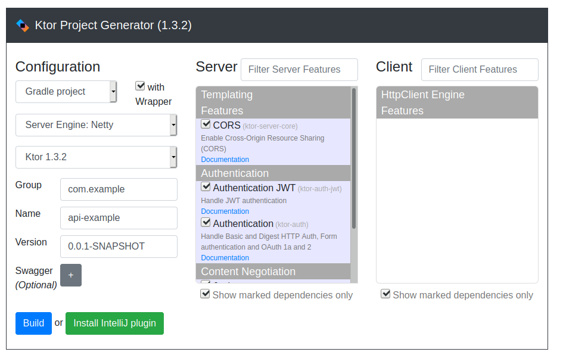
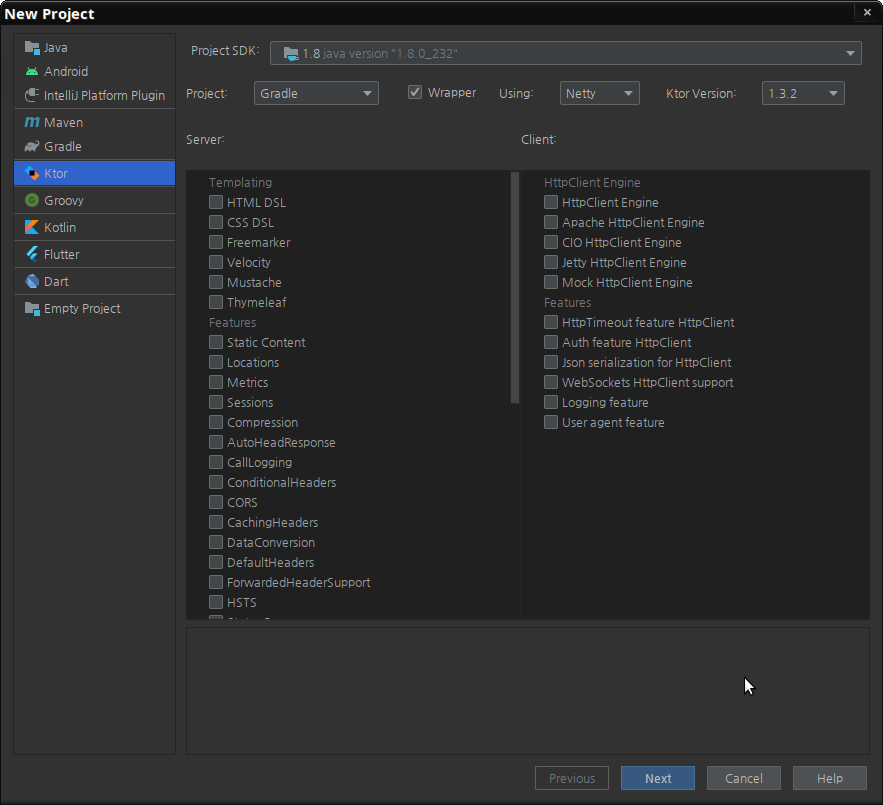
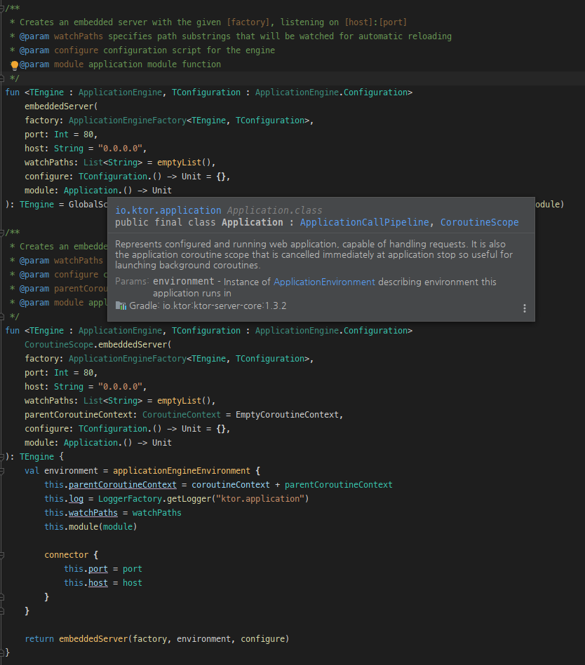

# Ktor


https://ktor.io/

## 프로젝트 생성

아래의 두가지 방법을 제공한다  

1. [start.ktor.io](https://ktor.io/quickstart/generator.html)
  
1. IntelliJ IDE


참고로 현재 start.ktor.io를 통해 작성 프로젝트 소스는 모듈 기반으로 작성되어 있고  
HOCON (Human-Optimized Config Object Notation) 을 사용한다.  
모듈기반의 소스는 아래와 같다

```kotlin
package com.example

import io.ktor.application.*
import io.ktor.response.*
import io.ktor.request.*

fun main(args: Array<String>): Unit = io.ktor.server.netty.EngineMain.main(args)

@Suppress("unused") // Referenced in application.conf
@kotlin.jvm.JvmOverloads
fun Application.module(testing: Boolean = false) {
     
}
```

예를 들어 Todo라는 모듈을 추가 할 경우  
application.conf에 다음과 같이 추가한다  
```
modules = [ com.example.ApplicationKt.module, com.example.TodoKt.todoModule ]
```

**Todo.kt**
```kotlin

@Suppress("unused") // Referenced in application.conf
@kotlin.jvm.JvmOverloads
fun Application.todoModule(testing: Boolean = false) {
    routing {
        get("/todos") {
            call.respondText("...")
        }
    }
}
```

그외 EmbeddedServer를 사용하는 소스는 다음과 같다.  
아래 소스는 Ktor 홈페이지의 첫대문에서 보았던 소스이다. 

```kotlin
package com.example

import io.ktor.application.*
import io.ktor.response.*
import io.ktor.routing.*
import io.ktor.http.*
import io.ktor.server.engine.embeddedServer
import io.ktor.server.netty.Netty


fun main() {
    embeddedServer(Netty, 8000) {
        routing {
            get("/") {
                call.respondText("Hello world", ContentType.Text.Html)
            }
        }
    }.start(wait = true)
}
```

모듈기반으로 작성하는 것과 차이가 나는 것 같지만  
embeddedServer는 내부적으로 모듈을 만드는 팩토리메서드이다  



## Ktor server introduction and key concepts

### Application

 ktor application의 인스턴스를 [Application](https://api.ktor.io/latest/io.ktor.application/-application/index.html) 라고 한다. 그리고  
어플리케이션은 1개 이상의 모듈로 구성이 되어 있고  [ApplicationEnvironment](https://api.ktor.io/latest/io.ktor.application/-application-environment/index.html) 라는 테두리안에 존재한다.  
[Config설정](https://ktor.io/servers/configuration.html) 의 상세페이지를 참조한다

### [Features](https://ktor.io/servers/features.html)

feature는 어플리케이션에 플러그인(또는 확장) 할 수있는 기능을 말한다.  
아래와 같이 install 함수로 작동시킨다  

```kotlin
application.install(DefaultHeaders) {
   // configure feature
}
```

features는 처음 프로젝트를 생성 시 선택 할 수 있거나
만약에 원하는 feature가 없는 경우는 만들 수 도 있다는 것을 알아두자  

예를 들어 JSON으로 응답을 작성하기 위해 **Jackson** 이나 **gson** 등의 라이브러리를 사용할 것인데  
이를 위해서 해당 features를 설치해보자  
우선 pom.xml이나 build.gradle에 의존성을 추가한다.  

```
implementation "io.ktor:ktor-jackson:$ktor_version"
```

```kotlin
fun main() {
    embeddedServer(Netty, 8000) {

        install(ContentNegotiation) { //JSON으로 응답하기 위해 jackson을 사용한다 
            jackson()
        }

        routing {
            get("/") {
                call.respond("Hello Ktor")
            }

            get("/json") {
                call.respond(mapOf("goto" to "hell"))
            }
        }
    }.start(true)
}
```

간단하게 jackson()이라고 기술 할 수 도있고   
파라미터를 입력받아 아래와 같이 기술 할 수 도있다.  
```kotlin
 install(ContentNegotiation) {
        jackson {
            enable(SerializationFeature.INDENT_OUTPUT)
       }
 }
```
이제 브라우져로 http://localhost:8000/json 으로 접근해보자

기본적으로 주로 사용하는 **features**를 보면 아래와 같다

**StatusPages**

이건 서버상태를 상세하게 전달하는데 목적을 두는데  
쓰다보면 Exception 핸들링으로 쓰게된다.

```kotlin
   install(StatusPages) {
       exception<Throwable> { e ->
           call.respondText(e.localizedMessage, ContentType.Text.Plain, HttpStatusCode.InternalServerError)
       }
   }
```

**ContentNegotiation**

위에서 설명한대로 Json serialization 처리를 하는것을 알 수 있다.  
반대로 deserialization은 파이프라인을 통해서 처리되는데 다음에 설명이 되어있다  
[Internal Pipeline Machinery](https://ktor.io/advanced/pipeline.html)


### [ApplicationCall](https://ktor.io/servers/calls.html)

ktor에서 요청과 응답이 pair로 묶여있는데 이를 ApplicationCall 이라한다  
모든 Call은 반드시 ApplicationCallPipeline(이하 파이프라인)를 걸치게 된다. 

```kotlin
 intercept(ApplicationCallPipeline.Call) { 
     if (call.request.uri == "/")
        call.respondText("Test String")
 }
```

파이프라인의 사용 예를 들자면  
클라이언트에서 json을 body에 실어서 보내면 Ktor는 ApplicationCall.receive<T>() 와 같은 함수로 받게 된다.  
즉 `call.receive<String>()` 으로 처리할 경우 body를 문자열로 읽어 들이게  된다.   

문자열로 받는다는 것이 당연한 듯 하지만 파이프라인을 거쳐서  
즉 ApplicationCallPipeline.receivePipeline 를 통해서 원래 body객체는 ByteReadChannel (asynchronous byte channel) 인데  
파이프라인을 통해서 문자열로 처리되어서 받아보게 되는 것이다.  

### [Routing](https://ktor.io/servers/features/routing.html)

라우팅 기능없이 인터셉터를 이용해서 구현이 가능하다.
하지만 실용적이진 않아 보인다.

```kotlin
intercept {
    val uri = call.request.uri
    when {
        uri == "/" -> call.respondText("Hello, World!")
        uri.startsWith("/profile/") -> { TODO("...") }
    }
}
```

Routing도 하나의 feature이므로 아래와 같이 추가 할 수 있지만  
편리하게도 DSL를 이용해서 단축표현을 쓸수 있다.  

```kotlin
 install(Routing) {
      get("/") {
         call.respond("Hello")
      }
  }
```

DSL를 이용한 추가  

```kotlin
fun main() {
    embeddedServer(Netty, 8000) {

   routing {
       get("/") {
          call.respondText("Hello, World!")
       }
  }
}
```

post로 객체를 받아보려면 data class를 작성하고 위에서 설명한 receive<T>로 받아보면 된다.  
```kotlin
data class Memo(val title: String, val text: String)

  post("/memo") {
     val memo = call.receive<Memo>()
     call.respond(memo)
 }
```


### Locations


```
dependencies {
    implementation "io.ktor:ktor-locations:$ktor_version"
}
```
```kotlin
fun main() {
    embeddedServer(Netty, 8000) {
     install(Locations) //install
    }     
}    
```


